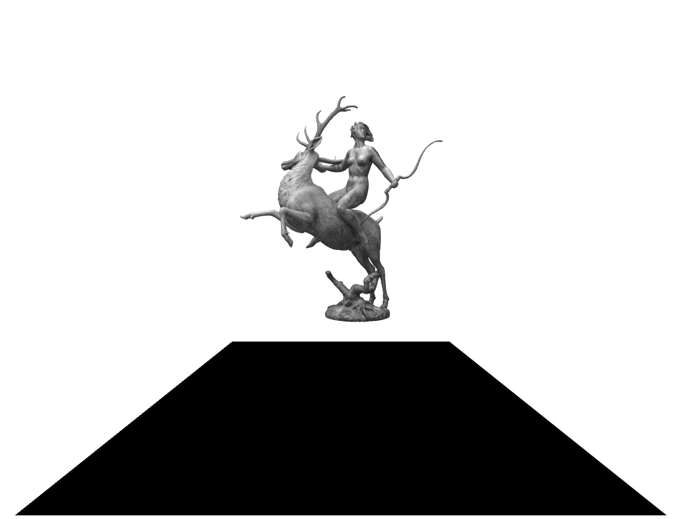

3D Rotating Artemis Sculpture
=============================

This is a demo of using the [A-frame framework](https://aframe.io) to display a 3D rotating sculpture in the browser.

It can be viewed in all browsers that A-frame supports. 

Among the VR headsets that can view this demo in 3D is Oculus Go, Oculus Quest, Vive Focus and the Google Daydream.

You need to start your browser in the VR headset and go to this page:

* http://vr.tderflinger.com.s3-website.eu-central-1.amazonaws.com

In the browser click on the icon on the bottom right to make the rotating sculpture full screen and immersive.

The Artemis Fountain is a sculpure by C. Bjerg and Poul Holsøe from 1934. It stands in the Tausen park in Copenhagen, Denmark.

[Artemis](https://en.wikipedia.org/wiki/Artemis) is a goddess of the hunt and wild animals in ancient Greek religion.

The original model can be downloaded here: https://sketchfab.com/3d-models/artemis-fountain-b9985a307aac41bbad4339fa46122d7a

The model is by Rigsters, license of the model is CC BY 4.0 (https://creativecommons.org/licenses/by/4.0/)

## Deployment

I deployed the 3D Artemis statue to AWS S3. Then I can view it directly by entering the address in the Oculus browser.
This saves me from having to open a developer account at Oculus to view the site on the Oculus device.

The *deployAWS.sh* is an example bash script for deployment. You can adapt it to deploy to your S3 account.

Of course you can also use other storage providers like Google Cloud Storage. Adapt the script accordingly.

## License

MIT License